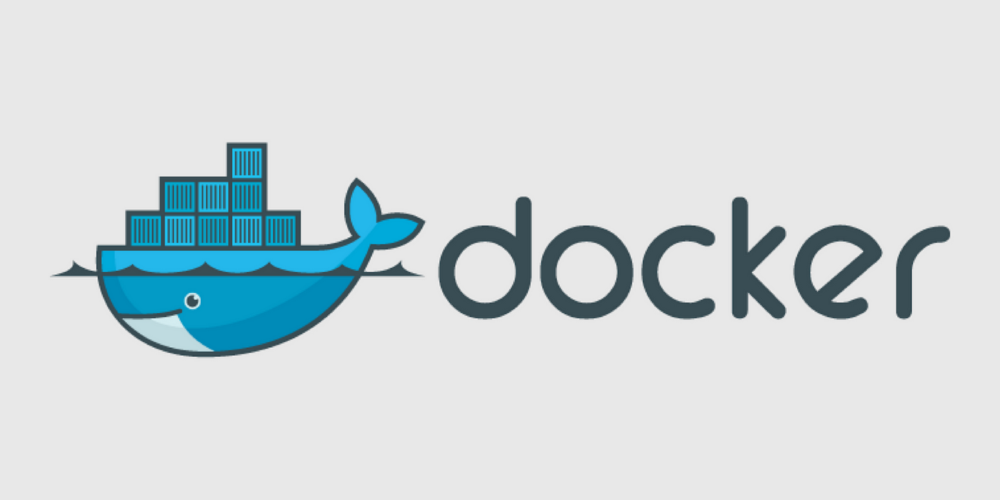

<p align="center">
    
</p>

## 📬 Docker: From Basics to Expert

Welcome to the Comprehensive Docker Handbook! This repository is your go-to resource for mastering Docker, covering everything from the basics to advanced concepts of Docker. With practical examples, step-by-step instructions, and useful commands, you'll gain the knowledge to work confidently with Docker in real-world scenarios.
---

### 📋 Table of Contents

1. [What is Docker?](#what-is-docker)
2. [Why Use Docker?](#why-use-docker)
3. [Docker Architecture](#docker-architecture)
4. [Installing Docker](#installing-docker)
5. [Basic Docker Concepts](#basic-docker-concepts)
6. [Docker CLI - Most Useful Commands](#docker-cli---most-useful-commands)
7. [Dockerfile Explained](#dockerfile-explained)
8. [Docker Compose](#docker-compose)
9. [Volumes, Networks & Ports](#volumes-networks--ports)
10. [Best Practices](#best-practices)
11. [Advanced Docker Usage](#advanced-docker-usage)
12. [Troubleshooting Tips](#troubleshooting-tips)
13. [Resources](#resources)

---

### 👉 What is Docker? {#what-is-docker}

Docker is a platform designed to make it easier to create, deploy, and run applications using containers. Containers allow a developer to package up an application with all its parts and dependencies.

---

### 👉 Why Use Docker? {#why-use-docker}

- Consistent environment across development and production.
- Lightweight and fast.
- Easy scalability and deployment.
- Supports microservices architecture.

---

### 👉 Docker Architecture {#docker-architecture}

- **Docker Engine**: Core component that runs and manages containers.
- **Images**: Read-only templates for containers.
- **Containers**: Running instances of images.
- **Docker Hub**: Public registry to find and share Docker images.
- **Here is the video tutorial from which I have leant about the docker architecture**
    - [Docker Architecture](https://youtu.be/d58s-yDEWuQ?si=2A5H_uwwBSBz7fFE)
---

### 👉 Installing Docker {#installing-docker}

- [Docker for Mac (Official Docs)](https://docs.docker.com/docker-for-mac/install/)
- [Docker for Windows (Official Docs)](https://docs.docker.com/docker-for-windows/install/)
- [Docker for Linux (Official Docs)](https://docs.docker.com/engine/install/)

#### 📺 Video Tutorials For Installing Docker:
- ✅ **Windows:** [Install Docker on Windows 10/11 | Step-by-step Guide](https://youtu.be/ZyBBv1JmnWQ?si=1rEMjJbZZVCIDRlE)
- ✅ **macOS:** [Install Docker Desktop on Mac | Easy & Fast Setup](https://youtu.be/2nR64QQH6sI?si=n-MdDkXMRwPeX3ud)
- ✅ **Ubuntu/Linux:** [Install Docker on Ubuntu | Beginner-Friendly Tutorial](https://youtu.be/J4dZ2jcpiP0?si=4WWJ-7-NrzfNuqaj)

---

### 👉 Basic Docker Concepts (Detailed) {#basic-docker-concepts}

Understanding these concepts is the key to using Docker effectively.

#### 🤖 1. **Docker Image**

A Docker **image** is like a snapshot or template of your application and everything it needs to run — including code, runtime, libraries, and environment variables.

**Example:**
```bash
docker pull nginx
```

#### 📦 2. **Docker Container**

A **container** is a running instance of an image.

**Example:**
```bash
docker run -d -p 80:80 nginx
```

#### 💾 3. **Docker Volume**

A **volume** is a persistent storage mechanism for Docker containers, allowing data to survive even after the container is removed.

**Example:**
```bash
docker run -v mydata:/app/data ubuntu
```

#### 🌐 4. **Docker Network**

Docker **networks** enable containers to communicate with each other.

**Example:**
```bash
docker network create mynetwork
docker run -d --network=mynetwork --name app1 nginx
docker run -d --network=mynetwork --name app2 alpine
```

#### 📜 5. **Dockerfile**

A **Dockerfile** is a text file with instructions on how to build a Docker image.

**Example:**
```dockerfile
FROM python:3.10
WORKDIR /app
COPY . .
RUN pip install -r requirements.txt
CMD ["python", "app.py"]
```

#### 🧰 6. **Docker Compose (Overview)**

**Use case example:**
- Web app + Redis cache
- Frontend + Backend + DB setup

---

### 👉 Docker CLI - Most Useful Commands {#docker-cli-most-useful-commands}

#### 🚀 Image Commands
```bash
docker build -t image_name .
docker pull image_name
docker images
docker rmi image_name
```

#### 💻 Container Commands
```bash
docker run image_name
docker run -d -p 8080:80 image_name
docker ps
docker stop container_id
docker rm container_id
```

#### 💾 Volume Commands
```bash
docker volume create volume_name
docker volume ls
docker volume inspect volume_name
```

#### 🌐 Network Commands
```bash
docker network ls
docker network create network_name
docker network connect network_name container_name
```

---

### 👉 Dockerfile Explained {#dockerfile-explained}

```dockerfile
FROM node:18
WORKDIR /app
COPY . .
RUN npm install
CMD ["npm", "start"]
```

---

### 👉 Docker Compose {#docker-compose}

```yaml
version: '3'
services:
  web:
    build: .
    ports:
      - "5000:5000"
  redis:
    image: "redis:alpine"
```

```bash
docker-compose up
```

---

### 👉 Volumes, Networks & Ports (Detailed & Illustrated) {#volumes-networks-ports}

#### 💾 **Volumes – Persisting Data**

Containers are temporary by default. **Volumes** keep data even when containers are removed.

**Example:**
```bash
docker volume create mydata
docker run -d -v mydata:/app/data ubuntu
```

**Visual:**
```
HOST FILE SYSTEM
      │
      ▼
[ Docker Volume: mydata ]
      │
      ▼
[ Container ] <--> /app/data
```

#### 🌐 **Networks – Communication Between Containers**

Containers can talk over a shared **Docker network**.

**Example:**
```bash
docker network create app-network
docker run -d --name backend --network app-network my-backend
docker run -d --name frontend --network app-network my-frontend
```

**Visual:**
```
[Docker Network: app-network]
    ├──────────────────────────────────┐      ┌──────────────────────────────────┐
    │  frontend  │ <--> │  backend   │
    └──────────────────────────────────┘      └──────────────────────────────────┘
```

#### 🔌 **Ports – Connecting to the Outside World**

Use ports to connect Docker containers with your host (e.g., browser).

**Example:**
```bash
docker run -d -p 8080:80 nginx
```
- Access Nginx at `http://localhost:8080`

**Visual:**
```
BROWSER --> localhost:8080 --> [ Docker Container: nginx (port 80) ]
```

---

### 👉 Best Practices {#best-practices}

- Keep images small.
- Use `.dockerignore`.
- Combine `RUN` instructions to reduce layers.
- Pin image versions.
- Regularly clean up unused resources.

---

### 👉 Advanced Docker Usage {#advanced-docker-usage}

- Multi-stage builds.
- Custom base images.
- Docker + CI/CD pipelines.
- Docker Swarm & Kubernetes.

---

### 🛠️ Troubleshooting Tips {#troubleshooting-tips}

- `docker logs <container_id>` — view logs.
- `docker inspect <container>` — deep info.
- `docker system prune` — clean up.
- Check Docker Desktop for resource issues.

---

### 📚 Resources {#resources}

- [Official Docker Docs](https://docs.docker.com/)
- [Play with Docker](https://labs.play-with-docker.com/)
- [Docker Cheatsheet](https://dockerlabs.collabnix.com/docker/cheatsheet/)

